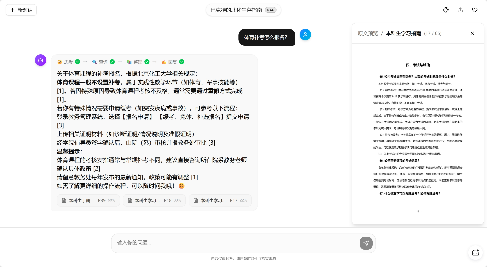
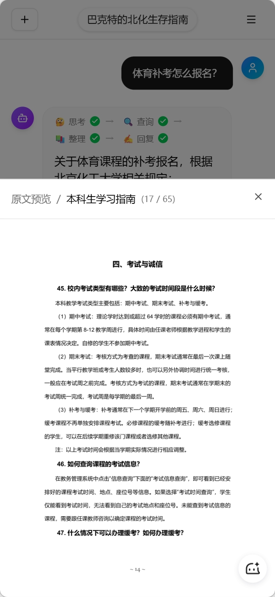

# BucterRagBot — 校园智答

基于 RAG（检索增强生成）的校园智能问答系统。整合分散在多份 PDF 手册中的制度信息，支持语义检索、流式生成与引用溯源。

> 🔗 [在线 Demo](https://bucter.zeabur.app)（早期版本，由于 Zeabur 取消免费额度暂未更新至最新版）

## 预览

<p align="center">
  
  
</p>

## 技术栈

| 层级 | 技术 |
|:---|:---|
| 框架 | Next.js 16 (App Router) |
| 语言 | TypeScript |
| 样式 | Tailwind CSS + shadcn/ui |
| 数据库 | Supabase (PostgreSQL + pgvector) |
| LLM | SiliconFlow (Qwen) |
| 数据处理 | Python + LangChain |

## 核心特性

### RAG 问答链路

基于 Next.js API Route 实现完整 RAG 流程：意图分类 → 向量检索（pgvector + HNSW 索引）→ Rerank 精排 → LLM 流式生成。根据意图类型动态裁剪处理阶段（闲聊跳过检索），AbortController 支持中断生成与终态收敛。

### 自定义混合协议

设计 JSON 头 + 分隔符 + 纯文本流的自定义协议格式，将检索元数据（intent、citations）与 LLM 文本流合并至单次 HTTP 连接传输。API Route 充当协议翻译层，隔离上游 LLM 厂商差异。

### 流式渲染性能优化

基于 fetch + ReadableStream 实现增量渲染，设计缓冲队列 + 双触发 flush 机制（字符阈值 + 定时器），解决逐 chunk setState 导致的冗余 React 重渲染，实测减少约 55% 不必要渲染。

### 虚拟列表

基于 @tanstack/react-virtual（headless 方案）实现长对话虚拟化渲染，结合组件级 memo 与 props 隔离，流式生成时仅当前消息参与重渲染。

### 移动端视口适配

基于 Visual Viewport API + CSS 变量实现视口高度管理，解决虚拟键盘弹起导致的布局错位，兼容不支持 dvh 的 WebView 环境。

### 智能滚动管理

封装 useScrollToBottom Hook，State + Ref 双轨制解决事件回调闭包陷阱，ResizeObserver 事件驱动替代轮询，实现流式生成跟随与用户浏览互不干扰。

## 项目结构

```
bucter-rag-bot/
├── web/                          Next.js 前端 + API 层
│   ├── src/app/
│   │   ├── page.tsx              聊天主页面（编排层）
│   │   └── api/chat/route.ts     RAG API（意图分类 → 检索 → 重排 → 生成）
│   ├── src/components/chat/      聊天组件（消息列表、气泡、输入框、溯源面板）
│   ├── src/hooks/                自定义 Hooks
│   │   ├── use-chat.ts           对话逻辑（流式请求 + 协议解析 + 缓冲调度）
│   │   ├── use-stream-buffer.ts  流式缓冲（双触发 flush）
│   │   ├── use-scroll-to-bottom.ts 智能滚动（State + Ref 双轨制）
│   │   └── use-visual-viewport.ts  移动端视口适配
│   └── src/lib/                  工具层（类型定义、Supabase 客户端）
└── scripts/                      Python 数据处理
    ├── ingest.py                 PDF 解析 → 分块 → 嵌入 → 入库
    ├── evaluate.py               检索质量评估
    └── setup_database.sql        数据库初始化
```

## 快速开始

### 环境要求

- Node.js ≥ 18
- Python ≥ 3.10（数据处理脚本）
- Supabase 账号（PostgreSQL + pgvector）
- SiliconFlow API Key（LLM 调用）

### 安装与运行

```bash
# 1. 克隆项目
git clone https://github.com/Dongmayyys/BucterRagBot.git
cd BucterRagBot

# 2. 配置环境变量
cp web/.env.example web/.env.local
# 填入 Supabase URL/Key 和 SiliconFlow API Key

# 3. 安装依赖
cd web && npm install

# 4. 启动开发服务器
npm run dev
```

### 数据入库（可选）

```bash
# 安装 Python 依赖
pip install -r requirements.txt

# 运行入库脚本（PDF → 分块 → 嵌入 → Supabase）
python scripts/ingest.py
```

## License

MIT