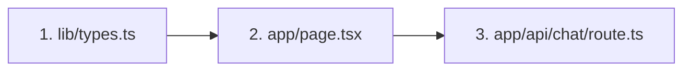

# 项目全景深度分析：校园 RAG 问答前端

---

## 1. 🏗 架构骨架 (Architecture & Stack)

### 技术栈雷达

| 模块               | 技术                        | 版本    | 选型理由                                      |
| ------------------ | --------------------------- | ------- | --------------------------------------------- |
| **框架**     | Next.js (App Router)        | 16.1.0  | React 全栈框架，支持 SSR/RSC，API Routes 内置 |
| **语言**     | TypeScript                  | 5.x     | 类型安全，前后端数据结构一致性                |
| **UI 库**    | React                       | 19.2.3  | 最新并发特性，更好的性能                      |
| **组件库**   | shadcn/ui + Radix           | -       | 可定制、无黑盒、设计感强                      |
| **样式**     | Tailwind CSS                | 4.x     | 原子化 CSS，响应式开发快                      |
| **图标**     | lucide-react                | 0.562.0 | 风格统一，按需引入，体积小                    |
| **Markdown** | react-markdown + remark-gfm | -       | 渲染 LLM 输出的 Markdown（表格/列表）         |
| **数据库**   | Supabase (向量检索)         | 2.89.0  | PostgreSQL + pgvector，BaaS 省运维            |
| **AI 调用**  | 原生 fetch                  | -       | 绕过 AI SDK v5 兼容性问题                     |

---

### 目录解剖

```
src/
├── app/                       # Next.js App Router 页面
│   ├── api/chat/route.ts      # ★ RAG API 核心入口
│   ├── page.tsx               # ★ 主聊天页面
│   ├── layout.tsx             #   根布局（字体/Metadata）
│   └── globals.css            #   全局样式 + CSS 变量
├── components/
│   ├── chat/                  # ★ 聊天专用组件（5个）
│   │   ├── chat-layout.tsx    #   响应式布局容器
│   │   ├── chat-list.tsx      #   消息列表 + 空状态
│   │   ├── chat-input.tsx     #   输入框（未使用，逻辑在 page.tsx）
│   │   ├── message-bubble.tsx #   消息气泡 + Markdown 渲染
│   │   └── source-bubble.tsx  #   引用来源卡片
│   └── ui/                    #   shadcn 基础组件（6个）
├── lib/
│   ├── types.ts               # ★ 类型定义（ChatMessage, Citation）
│   ├── supabase.ts            #   Supabase 客户端 + 向量检索函数
│   └── utils.ts               #   工具函数（cn）
└── hooks/
    └── use-sidebar.tsx        #   侧边栏状态管理
```

**设计意图：**

- `app/` 负责页面路由和 API，遵循 Next.js App Router 约定
- `components/chat/` 是业务组件，`components/ui/` 是通用基础组件
- `lib/` 存放与 UI 无关的逻辑（类型、数据库、工具）

---

### 设计模式

| 模式                             | 应用位置                                            | 说明                             |
| -------------------------------- | --------------------------------------------------- | -------------------------------- |
| **Feature-based 目录结构** | `components/chat/`                                | 按功能模块组织，非按文件类型     |
| **Client Component 边界**  | `page.tsx` 加 `'use client'`                    | 只在需要交互的组件使用客户端渲染 |
| **API Route 模式**         | `app/api/chat/route.ts`                           | 前后端同仓库，API 与页面并置     |
| **流式响应**               | `ReadableStream` + `Transfer-Encoding: chunked` | 服务端推送，所见即所得           |

---

## 2. 💎 模式提取 (Pattern Mining)

### 值得复用的套路

#### A. 流式消息更新（乐观 UI）

```typescript
// 先添加空消息，再逐步填充内容
setMessages(prev => [...prev, { id: assistantId, role: 'assistant', content: '' }]);

while (true) {
  const { done, value } = await reader.read();
  if (done) break;
  
  fullContent += decoder.decode(value);
  setMessages(prev => prev.map(msg => 
    msg.id === assistantId ? { ...msg, content: fullContent } : msg
  ));
}
```

**封装建议**：抽取为 `useStreamingMessage(fetchFn)` hook

---

#### B. 响应式侧边栏（PC + 手机）

```typescript
// PC 端：固定侧边栏
<aside className="hidden md:flex md:w-64">...</aside>

// 手机端：Sheet 弹出
<Sheet>
  <SheetTrigger asChild>
    <Button className="md:hidden">...</Button>
  </SheetTrigger>
  <SheetContent side="left">...</SheetContent>
</Sheet>
```

**封装建议**：抽取为 `<ResponsiveSidebar>` 组件

---

#### C. 带建议的空状态

```typescript
if (messages.length === 0) {
  return (
    <div className="flex flex-col items-center">
      <h1>校园智能问答</h1>
      <div className="grid grid-cols-2 gap-3">
        {DEFAULT_SUGGESTIONS.map(s => (
          <button onClick={() => onSuggestionClick(s.query)}>
            {s.emoji} {s.title}
          </button>
        ))}
      </div>
    </div>
  );
}
```

**封装建议**：抽取为 `<EmptyStateWithSuggestions>` 组件

---

## 3. ⚖️ 权衡利弊 (Trade-offs)

| 取舍                            | 牺牲了什么                | 换取了什么               |
| ------------------------------- | ------------------------- | ------------------------ |
| **手写 SSE 解析**         | 代码量增加（~50行）       | 完全兼容 SiliconFlow API |
| **单页面放所有逻辑**      | `page.tsx` 224 行，略长 | 避免过度抽象，新手易读   |
| **未使用 AI SDK useChat** | 失去自动状态管理          | 避免 v5 兼容性问题       |
| **shadcn 复制代码**       | 升级需手动更新            | 可自由定制样式           |

---

## 4. 🧭 新手阅读建议

### 从这 3 个文件开始，最快看懂数据流



| 顺序 | 文件                                                                                                                         | 理解目标                                         |
| ---- | ---------------------------------------------------------------------------------------------------------------------------- | ------------------------------------------------ |
| 1    | [lib/types.ts](file:///c:/Users/Dongmay/.gemini/antigravity/playground/azimuthal-zodiac/web/src/lib/types.ts)                   | 数据结构：`ChatMessage`, `Citation` 长什么样 |
| 2    | [app/page.tsx](file:///c:/Users/Dongmay/.gemini/antigravity/playground/azimuthal-zodiac/web/src/app/page.tsx)                   | 前端交互：消息如何发送、流式如何渲染             |
| 3    | [app/api/chat/route.ts](file:///c:/Users/Dongmay/.gemini/antigravity/playground/azimuthal-zodiac/web/src/app/api/chat/route.ts) | 后端逻辑：检索→Rerank→LLM→流式返回            |

---

## 5. 数据流可视化

```
┌────────────────────────────────────────────────────────────────────────┐
│ 前端 (page.tsx)                                                         │
│                                                                        │
│  用户输入 ──▶ handleSubmit() ──▶ fetch('/api/chat') ──▶ reader.read()  │
│                                      │                       │         │
│                                      │                       ▼         │
│                                      │              setMessages(流式更新)│
└──────────────────────────────────────│─────────────────────────────────┘
                                       │
┌──────────────────────────────────────│─────────────────────────────────┐
│ 后端 (route.ts)                      ▼                                 │
│                                                                        │
│  提取 query ──▶ embed() ──▶ vectorSearch() ──▶ rerank() ──▶ LLM API   │
│                   │              │                │           │        │
│                   ▼              ▼                ▼           ▼        │
│             SiliconFlow      Supabase        SiliconFlow   SiliconFlow │
│             Embedding        pgvector         Rerank      Chat Compl.  │
└────────────────────────────────────────────────────────────────────────┘
```
